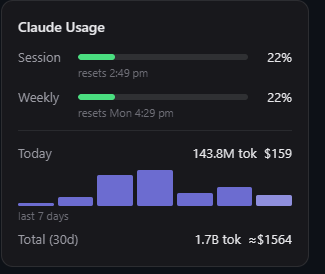

# Claude Usage Meter

A minimal system-tray (menu-bar) app for Windows, macOS, and Linux that shows your Claude usage at a glance.

The tray icon is a live progress ring of your **session (5-hour) limit** — green, amber, or red as you approach it. Hover the icon (or, on Linux, right-click → **Show usage…**) for the full picture:

<p align="center">
  
</p>

## Features

- **Session & weekly limits** — the same numbers as Claude Code's `/usage`, fetched with your existing Claude Code login. No setup.
- **Local usage stats** — today's tokens and cost, a 7-day sparkline, and a 30-day total, computed from Claude Code's local transcript data (cost for older history is a blended-rate estimate, marked `≈`).
- **API key spend (optional)** — month-to-date organization spend via the Anthropic Admin API. Save an admin key (`sk-ant-admin…`) in Settings; it's stored in your OS secret store (Windows Credential Manager / macOS Keychain / Linux Secret Service), never on disk.
- **Tray niceties** — on Windows and macOS, hover to peek, click to pin, `Esc` to dismiss. On Linux, right-click the tray icon → **Show usage…** (the Linux tray has no hover/left-click events). Right-click everywhere for Refresh now, Settings, Start at login, Quit.
- Lightweight: ~3 MB installer, ~45 MB RAM, no Electron.

## Requirements

- Windows 10/11, macOS 12+, or a Linux desktop with a system tray (StatusNotifier/AppIndicator) and a Secret Service keyring (gnome-keyring or KWallet) for the optional admin-key feature
- [Claude Code](https://claude.com/claude-code) installed and signed in (limits and local stats read from `~/.claude`)

## Install

Grab the binary for your OS from [Releases](../../releases):

- **Windows** — `.exe` NSIS installer
- **macOS** — `.dmg`
- **Linux** — `.deb` (Debian/Ubuntu/Mint)

The release binaries are **unsigned** (open-source, no paid signing certs yet):

- **macOS:** Gatekeeper will block the first launch. Right-click the app → **Open**, then confirm; or run `xattr -dr com.apple.quarantine "/Applications/Claude Usage Meter.app"`.
- **Windows:** SmartScreen may warn. Click **More info → Run anyway**.

Or build from source:

```sh
# prerequisites: Rust (stable), Node 20+
npm install
npm run tauri build
```

For development: `npm run tauri dev`.

## How it works

| Data | Source | Refresh |
|---|---|---|
| Session / weekly % | Anthropic OAuth usage endpoint, using the token Claude Code already stores in `~/.claude/.credentials.json` | 60 s |
| Today / 7-day / 30-day stats | `~/.claude/projects/**/*.jsonl` transcripts (mtime-bounded, per-file parse cache) + `stats-cache.json` history | 30 s |
| API spend | `GET /v1/organizations/cost_report` with your admin key | 10 min |

Everything degrades gracefully: network down or token expired shows last-known data with a `stale` badge — no error dialogs. The app never sends your data anywhere except to Anthropic's own APIs.

## Privacy & safety notes

- The OAuth token is read from (and on expiry, refreshed back into) Claude Code's own credentials file — writes are atomic and yield if Claude Code refreshed first.
- The Admin API key lives in your OS secret store (Windows Credential Manager / macOS Keychain / Linux Secret Service) under `claude-usage-meter`.
- No telemetry, no third-party endpoints.

## Tests

```powershell
cd src-tauri
cargo test   # 28 tests: JSONL parsing/dedup, pricing, OAuth refresh paths (mocked), cost-report pagination, icon rendering
```

## License

[GPL-2.0](LICENSE)
